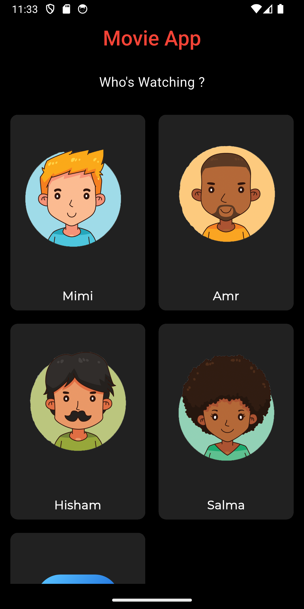
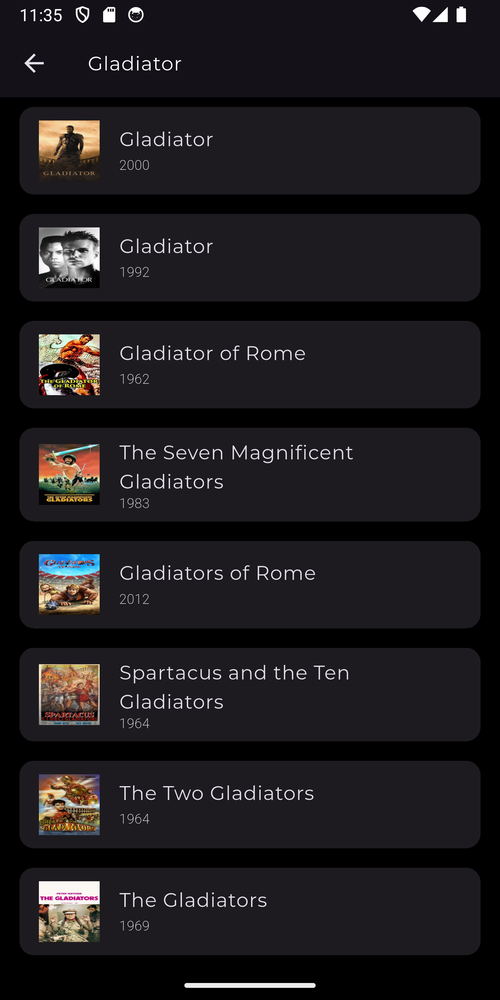

# 🎬 Movies App

A Flutter Movies app that allows users to explore trending, popular, and top-rated movies with a smooth and engaging UI, Built with Clean Architecture, powered by Use Cases & Cubit for seamless movie search!

---

## ✨ Features
- Browse trending, popular, and top-rated movies.
- View detailed movie information, including ratings and overviews.
- Search for movies by title.
- Clean and maintainable architecture.
- Smooth and responsive user experience.

---

## 🛠️ Tech Stack
- **State Management:** Cubit
- **Dependency Injection:** GetIt
- **Navigation:** GoRouter
- **Architecture:** MVVM
- **Networking:** Dio
- **Local Storage:** Hive
- **Pagination:** Infinite Scroll Pagination for smooth browsing

---

## 🎥 Demo GIF

  

---

## 📸 Screenshots

 

 

---

## ⚙️ Requirements

- To run this project, you must set up your API keys:
- Add your TMDB API Key in the API keys file.

---

